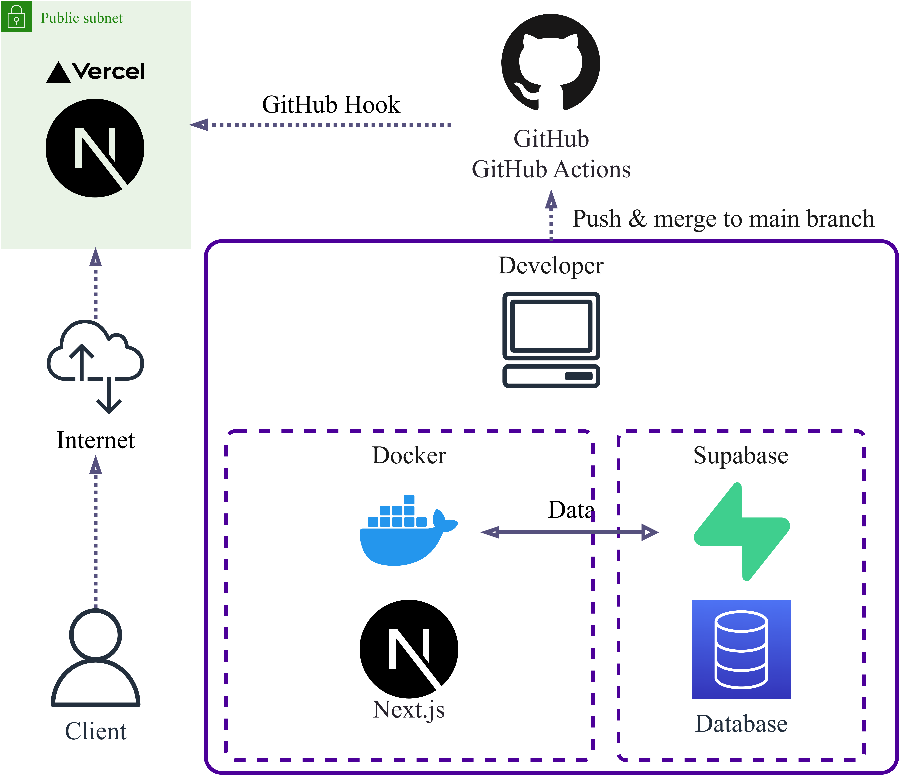

# AttManage
勤怠管理におけるシフトの登録と自動割り当てを可能にするアプリです．
<br />

## サービスURL
[https://att-manage.vercel.app/pages/shift](https://att-manage.vercel.app/pages/shift)
<br />

## サービス概要
本サービスでは，勤怠管理がシフト管理機能，打刻機能，給与計算機能の三つから構成されると考えます．その上で，2025年1月現在は，シフト管理機能に焦点を当て，各従業員ごとのシフトの登録機能やオーナーのシフト要求登録機能，シフトの自動割り当て機能を提供するサービスです．
<br />

## サービスを開発した背景
少子高齢化が進む現代社会にとって，小・中規模事業における人手不足が今後ますます大きな課題となることが予想されます．この問題の解決，もしくは緩和のための糸口の一つとして，単に従業員を増やすだけではなく，事務作業のような本来の事業とは関係の薄い負担をなるべく減らし，少ない従業員数でより効率的に経営することが挙げられます．本サービスでは，事業主様の勤怠管理に関する負担を削減，又は緩和させることを目的とし，シフト管理，打刻，給与計算の三つの主な機能で構成される勤怠管理サービスの実現を目指します．
<br />

## 画面や機能の説明
ユーザーは次の役職を持つことが想定されます．
* `Employee` : 従業員
* `Owner` : 雇用主

### お試し用アカウント

以下の三つのアカウントを利用してサービスを利用できます．サインアップページから個人アカウントを作成することも可能です．

| ユーザー名 | メールアドレス   | パスワード | ロール    |
| ---       | ---             | ---       | ---      |
| User1     | User1@gmail.com | User1000  | Employee |
| User2     | User2@gmail.com | User2000  | Employee |
| Owner1     | Owner1@gmail.com | Owner1000  | Owner |


### 各種ページ

| シフト管理トップページ |　サインインページ |
| ---- | ---- |
|  |  |
| シフト管理画面のトップページです．ユーザーシフト設定ページ，オーナーシフト要求決定ページ，シフト自動割り当てページの三つのリンクがあります． | サインインするためのページです．メールアドレスとパスワードを入力する必要があります． |

| サインアップページ |　ユーザーシフト設定ページ |
| ---- | ---- |
|  |  |
| サインアップするためのページです．ユーザー名，メールアドレス，パスワードを登録する必要があります． | ユーザー個人のシフトを登録するページです．カレンダー上でのクリック，ドラッグアンドドロップなどのマウス操作で直感的にシフトを設定することが可能です． |

| オーナーシフト要求決定ページ | シフト自動割り当てページ |
| ---- | ---- |
|  |  |
| オーナーが必要とされるシフト要求を設定するページです．ユーザーシフト設定ページと同様にカレンダー上のマウス操作でシフトを設定します． | ユーザーの設定したシフトと，オーナーの要求したシフトから自動的にユーザーのシフトを割り振る機能です． |

### 操作例
* [シフトの自動割り当て機能](./docs/shift-apply-ex1.md)

<br />


## 仕様技術
| Category          | Technology Stack                                     |
| ----------------- | --------------------------------------------------   |
| Frontend          | TypeScript, Next.js, CSS, CSS Modules                     |
| Backend           | TypeScript, Next.js                           |
| Infrastructure    | Vercel                          |
| Database          | Supabase                                           |
| Monitoring        | -                                |
| Environment setup | Docker                                               |
| CI/CD             | GitHub Actions                                       |
| Design            | -                                         |
| etc.              | Git, GitHub |

<br />

## システム構成図


<br />

## ER図

[dbdiagram.ioでER図を見る](https://dbdiagram.io/d/AttManage_ER-678c99a06b7fa355c352735b)
<iframe
    src="https://dbdiagram.io/d/AttManage_ER-678c99a06b7fa355c352735b"
    width="100%"
    height="600"
    frameborder="0"
    allowfullscreen>
</iframe>


<br />

## ファイル構成

```plaintext
📂 src
├── 📂 app
│   ├── 📂 components                      # UIコンポーネント群（クライアントサイド）
│   │   ├── 📂 server                      # サーバーサイド専用コンポーネント
│   │   ├── 📂 client                      # クライアントサイド専用コンポーネント
│   │   └── 📂 shared                      # サーバー・クライアントで共通利用するコンポーネント
│   ├── 📂 api                             # クライアント用のAPIエンドポイント（サーバーサイド）
│   ├── 📂 models                          # データベース操作を行うロジック層（サーバーサイド）
│   ├── 📂 pages                           # 実際に表示されるページのエンドポイント
│   ├── 📂 context                         # グローバル状態管理用のコンテキストAPI
│   ├── 📂 hooks                           # 再利用可能なロジックをまとめたカスタムフック
│   ├── 📂 utils                           # 汎用的なユーティリティ関数
│   └── 📂 services                        # ビジネスロジックをまとめたクラス
```


### 各ディレクトリの詳細

1. 📂`components`  
   UIを構成するコンポーネント群。`server`, `client`, `shared` の3つに分けて整理し、用途別に管理します。
   - `server`: サーバーサイド専用のコンポーネント。
   - `client`: クライアントサイド専用のコンポーネント。
   - `shared`: サーバーとクライアントで共通で利用するコンポーネント。

2. 📂`api`
   クライアント用APIエンドポイントを管理。サーバーサイドで動作し、データの提供や処理を行います。

3. 📂`models`  
   データベース操作用のロジックを管理。DB操作やORMを使用したCRUD処理を実装します。

4. 📂`pages`  
   実際に表示されるエンドポイント（ルート）。各ページで使用するコンポーネントや状態を統合して管理します。

5. 📂`context`  
   アプリ全体で共有する状態を管理するコンテキストAPI。頻繁に利用されるデータや設定を効率的に管理できます。

5. 📂`hooks`  
   再利用可能なカスタムフックを管理。状態やロジックを使い回しやすくするために実装します。

6. 📂`utils` 
   汎用的で再利用可能な関数をまとめます。特定のビジネスロジックに依存せず、他のモジュールでも利用可能。

7. 📂`services`  
   ビジネスロジックを実装するクラスや関数を管理。複雑な処理や外部APIの連携を担当します。


<br />

## インストールと実行

作成中．

<br />


## 今後の展望

2025年1月現在は，各従業員ごとのシフトの登録機能やオーナーのシフト要求登録機能，シフトの自動割り当て機能に限らていますが，今後は機能を拡張する可能性があります．

理想的な構想としては，シフト管理，打刻，給与計算の三つの機能を提供し，最終的にはそれら三つを従業員の各自で利用することで，勤怠管理に必要な工程がオーナーの関与無しに自動的に運営されることを目指したいと考えています．

<br />
