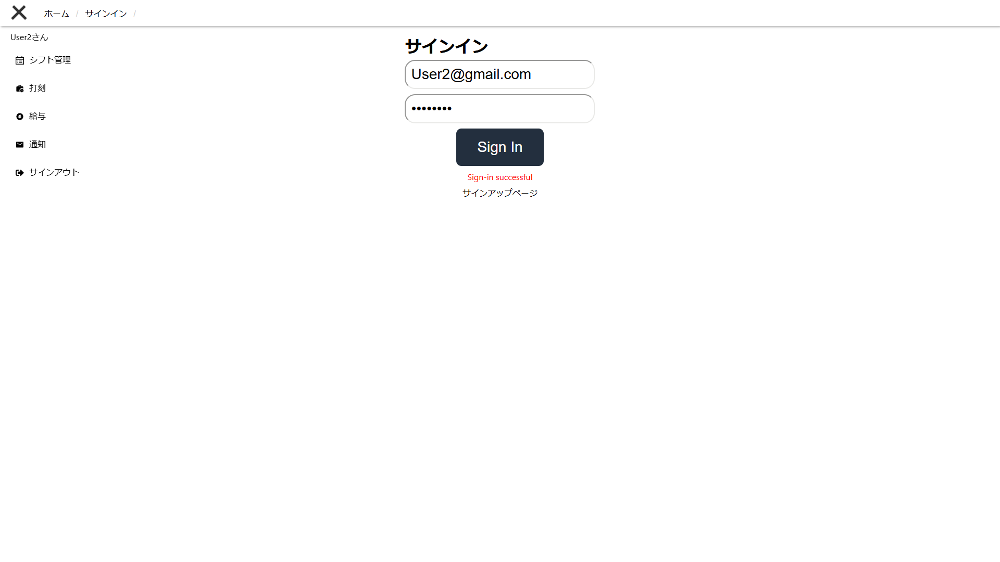
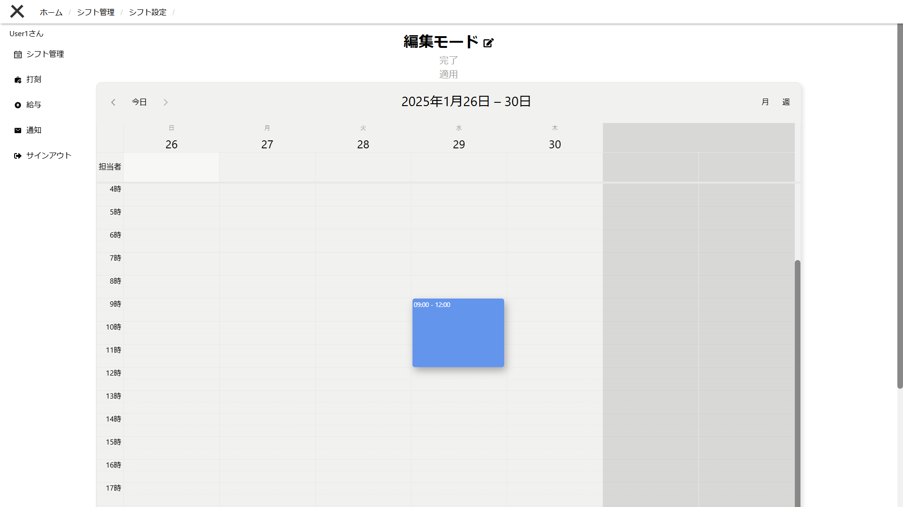
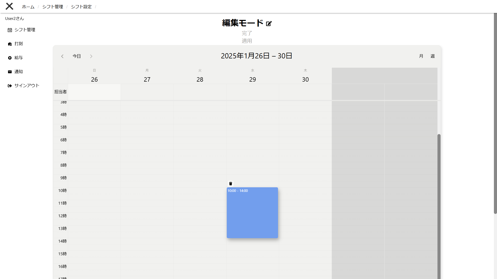
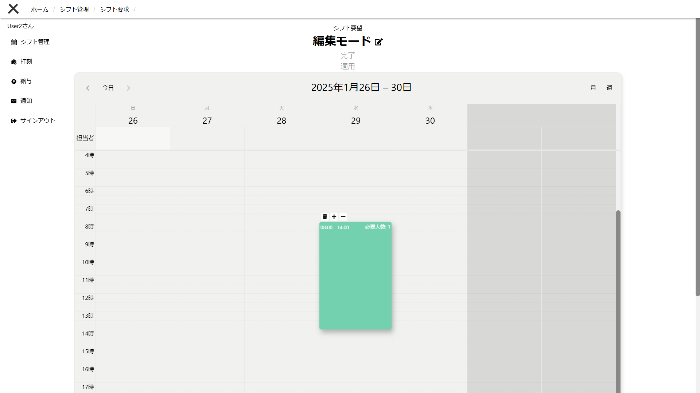
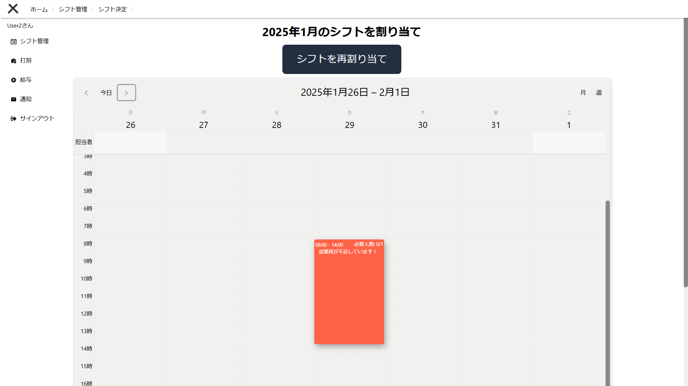
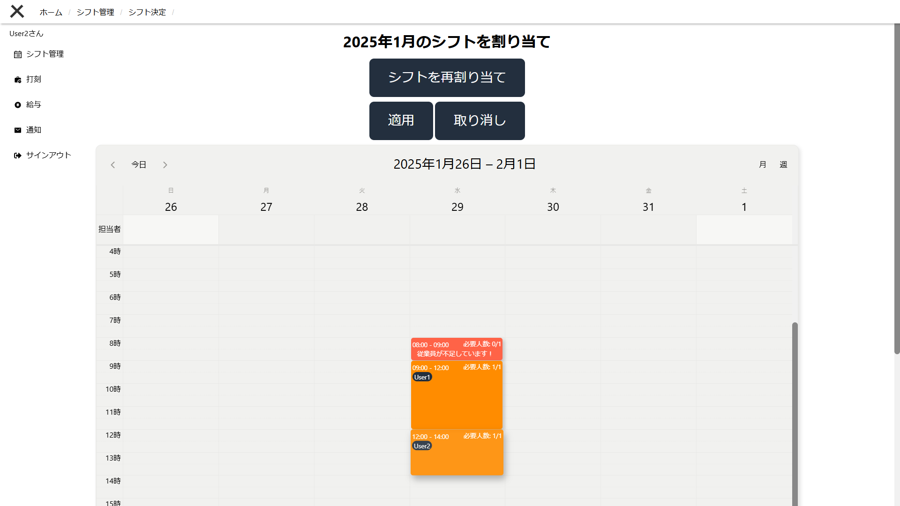

# シフトの割り当て例

サービス全体の説明は[サービスのREADME](../README.md)をご覧ください．

## 1. サインイン
[お試しアカウント](../README.md#お試し用アカウント)などのアカウントでサインインをします．

## 2. ユーザーシフト設定ページでユーザーのシフト予定を設定
シフトの設定には編集モードと閲覧モードがあり，編集する場合には一度編集ボタンを教えて編集モードに遷移する必要があります．
カレンダーは週間ビューと月間ビューがあり，表示方法を好きなように変更することが可能です．また，カレンダーの特定の日付をダブルクリックすることで，特定の日付を表示するサイドスライドで確認することも可能です．

この機能によって**ユーザーはオーナーの関与無しに，自身の勤務可能なシフトを登録することが可能**です．

今回は，User1,2においてそれぞれ9:00-12:00，10:00-14:00としてシフトを登録します．

▲User1では9:00-12:00でシフトを登録．

▲User2では10:00-14:00でシフトを登録．

## 3. オーナーシフト要求決定ページでシフトの要求を設定

オーナーシフト要求決定ページでは，オーナーが従業員に入ってほしいシフトを設定します．
設定方法はユーザーのシフト設定と同じですが，シフト上にカーソルをホバリングした際に表示されるボタンを操作することで，必要とする従業員数も変更することが可能です．
ここでは8:00-14:00としてシフトを登録します．

## 4. シフト自動割り当てページでシフトの割り当て

このページでは各個人のシフト設定と，オーナー側のシフト要求を基に，シフト割り当てボタンを押すことで自動でシフトを割り振ることが可能です．

シフト割り当てボタンを押すだけで，サービスが自動的にシフトを割り当てます．割り当て後は「適用」または「取り消し」を選択することができ，割り当て結果のシフトを確認することが可能になります．

▲シフトの割り当て前の状態では，必要な従業員が不足している時間帯が赤く表示されます．

▲シフトの割り当て実行後の表示．割り当てされた時間帯は黄色で表示され，担当する従業員が黒い楕円で表示される．

[サービスのREADMEに戻る](../README.md)